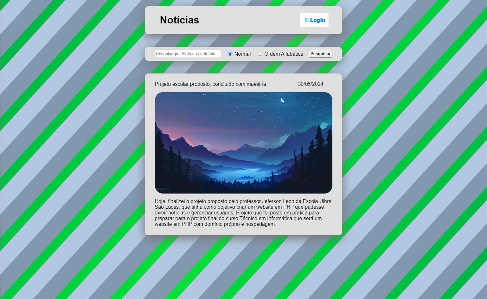

# Clínica Nutrição Project




<p>The objective of this project is to develop a PHP based website, that have a function to show notices, what is addicted by the users. The project appliyed the use o CRUD (Create, Read, Update and Delete) method and use of objects in the logic of website</p>

## 💻 Prerequisites

Before start, check if you have the requisites below:

- You have XAMPP installed,

## 🚀 Installation

To running this webpage, follow these steps:

- Access the path where XAMPP are installed, and access the htdocs folder:

```
"C:\xampp\htdocs"
```

- Make download of the .Zip folder of my project 'conexaoDB' in github, and unzip the content inside the htdocs folder of XAMPP;

- After this open your server control pannel (XAMPP Control Pannel), start Apache service;

- And in your browser, type on navigation bar the path:

```
localhost/{name of the folder you created inside htdocs}/{name.php of the php archive that contains the webpage}
```
